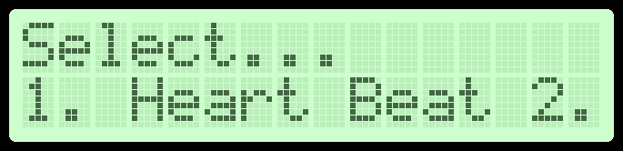

---
header-includes:
    - \usepackage{fancyhdr}
    - \newcommand{\hideFromPandoc}[1]{#1}
    - \pagestyle{fancy}
    - \fancyhead{} 
    - \fancyhead[LE,LO]{SUPSI-DTI}
    - \fancyhead[RO,RE]{Gruppo 07}
    - \fancyfoot{}
    - \fancyfoot[CE,CO]{\thepage}
    - \usepackage{tikz}
---


# HeartBeat
> Programmazione di Microcontrollori (ProMC)

## Sommario

Questo rapporto descrive, in maniera sintetica, un sistema di monitoraggio del battito cardiaco (*Heart Beat*) 
realizzato sulla board BasysMX3 (con microcontrollore `PIC32MX370F512L`) e utilizzante il sensore `KY-039`.
Verranno illustrate le funzioni principali del programma, corredate da alcuni snippet di codice per dare un’idea della 
struttura generale del progetto.

## 1. Introduzione

Il sistema Heart Beat misura il battito cardiaco posizionando un dito sul sensore `KY-039` (basato su LED IR e
fototransistor). 
I BPM (battiti per minuto) calcolati vengono mostrati:

* Sull'LCD integrato (via *PMP*);
* Sul Serial Plotter collegato tramite `UART`.

Inoltre sarà possibile salvare il valore massimo di bpm in una memoria Flash On-Board, e ripristinarlo in un secondo 
momento, oppure eliminarlo (*reset*).

## 2. Funzionalità Principali

All’avvio, il LED RGB si illumina di colore verde, e un menù sul LCD propone tre opzioni:

1. **HeartBeat**: avvio del monitoraggio;
2. **Max bpm**: visualizzazione del bpm massimo memorizzato;
3. **Reset**: cancellazione dati in memoria.



$\pagebreak$

## 3. Struttura del Codice

### Inizializzazione

Il microcontrollore viene inizializzato configurando le varie periferiche (`Timer`, `UART`, `PMP`, `SPI`, `ADC`, ...).
Le funzioni e procedure di inizializzazione di ogni periferica sono contentute nelle librerie specifiche ad ognuna di 
esse, e sono perlopiù simili o identiche a quelle sviluppate durante le ore di laboratorio.

Fanno eccezione solo alcune (come `Timer`, `GPIO`, `PMP` e `KY-039`) che sono state personalizzate per il progetto.

```c
int main(void) {
    // GPIO Initialization
    rgb_pins_init();
    btn_pins_init();
    btn_interrupt_init();
    speaker_pins_init();
    // Timer Initialization
    timer_init();
    // UART Initialization
    uart_init_pins();
    uart_init(9600);
    // PMP Initialization
    lcd_init();
    // KY-039 Initialization
    ky39_init();
    // ADC Initialization
    adc_init();
    // Output Compare Initialization
    oc_init();
    // SPI Initialization
    init_spi1();
    rgb_set_color(0, 1, 0);
    stop_lcd = 0;
    // Initialize the sensor readings buffer
    for (int i = 0; i < READ_BUFSIZE; i++) reading_buf[i] = 0.0;
    while (1) {
        // ...
    }
    return 0;
}
```

$\pagebreak$

### Main Loop (*Gestione Menu*)

Nel *loop principale* del programma, questo mostra il menù in *Figure 1* e attende la ricezione di una scelta, da parte
dell'utente, tramite la console seriale (`UART`).

La selezione invoca la funzione corrispondente:

```c
// ...
while (1) {
    char *hb = "1";
    char *mb = "2";
    char *rs = "3";        
    start_menu();
    if (flag_rx) {
        char *str = get_strg();
        if (strcmp(str, hb) == 0) {
            heart_beat();
        } else if (strcmp(str, mb) == 0) {
            max_bpm();
        } else if (strcmp(str, rs) == 0) {
            reset_max_bpm();
        } else {
            invalid();
        }
    }
    flag_rx = 0;
    sleep(20);
}
```

### Funzione `heart_beat()`

La funzione `heart_beat()` si occupa di monitorare il battito cardiaco, calcolando i BPM e visualizzandoli sul display.

Ciò viene effettuato dapprima avviando l'acquisizione di dati dal sensore `KY-039`, notificando l'avvio tramite un
*beep* dallo speaker.

Una volta operativa, il `LED RGB` cambia colore, da verde a blu, ed il display LCD viene popolato con il valore di BPM
corrente, che viene aggiornato circa ogni $10$ secondi.

**Nota**: 

> il valore acquisito dal sensore non è immediatamente traducibile in battiti al minuto, e quindi si devono
> prevedere almeno $20-30$ secondi di acquisizione prima di avere una lettura realistica;
> inoltre il sensore è molto suscettibile alla luce naturale ed artificiale presente nell'ambiente di utilizzo
> e quindi è consigliabile utilizzarlo in condizioni di scarsa luminosità o di coprirlo durante la lettura.

```c
void heart_beat(void) {
    rgb_set_color(0, 0, 1);
    // ...
    busy_measure = 1;
    beep(10);
    t3_start();
    while(busy_measure) {
        int read = ky39_read();
        // The signal received from the sensor is passed through a Low-Pass 
        // filter which trims off high frequencies
        float tmp = (0.1 * read) + ((1.0 - 0.1) * previous_lowpass);
        previous_lowpass = tmp;
        // The signal is then stored in a circular buffer of size READ_BUFSIZE
        buf_sum -= reading_buf[read_buf_index];
        reading_buf[read_buf_index] = tmp;
        buf_sum += reading_buf[read_buf_index];
        read_buf_index = (read_buf_index + 1) % READ_BUFSIZE;
        filtered_sig = buf_sum / READ_BUFSIZE;
        // Every 1000 reading (10 seconds) are saved in a vector, which 
        // is then used to compute the BPM through an approximated peak count.
        if (cur_reading_idx < READINGS_LEN) 
            readings[cur_reading_idx++] = filtered_sig;
        else {
            bpm = current_bpm();
            cur_reading_idx = 0;
            if (max_bpm_m <= bpm) max_bpm_m = bpm;
        }
        // To show a graph on the serial plotter be sure to transmit a 
        // "carriage return" after every data entry.
        sprintf(str_bpm, "%f\r\n", filtered_sig);
        uart_puts_4(str_bpm);        
    }
    write_flash(MAX_BPM_FADDR, max_bpm_m);
    t3_stop();
    stop_lcd = 0;
    rgb_set_color(0, 1, 0);
}
```

Il segnale letto viene inoltre passato in un *low-pass filter* che riesce a rimuovere le alte frequenze che disturbano
la lettura, e viene memorizzato in un buffer circolare di dimensione `READ_BUFSIZE`.

Una volta acquisiti $1000$ valori (circa $10$ secondi), questi vengono utilizzati per calcolare i BPM attraverso un
conteggio approssimato dei picchi.
Questo valore viene infine memorizzato in una variabile globale `max_bpm_m` e scritto in memoria Flash.

Per arrestare la misurazione, l'utente può premere il pulsante `BTNC`.

### Funzione `max_bpm()`

La funzione `max_bpm()` si occupa di visualizzare il valore massimo di BPM memorizzato in memoria Flash.

Se la memoria Flash si trova a stato di `RESET` (valore `255`), viene visualizzato `--` al posto del valore in BPM.

```c
void max_bpm(void) {
    int max_bpm = read_flash(MAX_BPM_FADDR);
    char str_bpm[16];
    if (max_bpm == 255) sprintf(str_bpm, "Max BPM:      --");
    else sprintf(str_bpm, "Max BPM: %7d", max_bpm);
    busy_measure = 1;
    while (busy_measure) {
        clr_lcd();
        puts_lcd(str_bpm);
        nl_lcd();
        puts_lcd("################");
        sleep(1000);
    }
}
```

Per uscire dalla visualizzazione della massima frequenza cardiaca, l'utente può premere il pulsante `BTNC`.

### Funzione `reset_max_bpm()`

La funzione `reset_max_bpm()` si occupa di azzerare il valore massimo di BPM memorizzato in memoria Flash.

Viene cancellata tutta la memoria flash, per assicurarsi che nessun dato sia presente, e viene visualizzato un messaggio
per $2$ secondi. Fatto ciò, il sistema torna al menù principale.

```c
void reset_max_bpm(void) {
    // ...
    erase_flash();
    // ...
}
```

## Flowchart

## Main Loop

```{=latex}
\usetikzlibrary{shapes.geometric, arrows}
\tikzstyle{startstop} = [rectangle, rounded corners, minimum width=2cm, minimum height=1cm, text centered, draw=black, fill=red!30]
\tikzstyle{io} = [trapezium, trapezium stretches=true, trapezium left angle=70, trapezium right angle=110, minimum width=2cm, minimum height=1cm, text centered, draw=black, fill=blue!30]
\tikzstyle{process} = [rectangle, minimum width=2cm, minimum height=1cm, text centered, text width=2cm, draw=black, fill=orange!30]
\tikzstyle{decision} = [diamond, minimum width=3cm, minimum height=1cm, text centered, draw=black, fill=green!30]
\tikzstyle{arrow} = [thick,->,>=stealth]

\begin{tikzpicture}[node distance=2cm]

\node (start) [startstop] {Start};
\node (menu) [process, below of=start] {Start Menu};
\node (uartin) [io, below of=menu] {UART Input};
\node (uartip) [decision, below of=uartin, yshift=-0.5cm] {Input flag?};
\node (it) [decision, below of=uartip, yshift=-1.5cm] {Input = ?};
\node (hb) [process, below of=it, yshift=-0.5cm, xshift=-4.5cm] {Heart Beat};
\node (max) [process, below of=it, yshift=-0.5cm, xshift=-1.5cm] {Max BPM};
\node (reset) [process, below of=it, yshift=-0.5cm, xshift=1.5cm] {Reset};
\node (invalid) [process, below of=it, yshift=-0.5cm, xshift=4.5cm] {Invalid};
\node (btnc) [io, below of=hb, yshift=-0.5, xshift=1.5cm] {BTNC press};

\draw [arrow] (start) -- (menu);
\draw [arrow] (menu) -- (uartin);
\draw [arrow] (uartin) -- (uartip);
\draw [arrow] (uartip) -- node[anchor=west] {yes} (it);
\draw [arrow] (uartip) -- +(4,0) |- node[anchor=south] {no} (menu);
\draw [arrow] (it) -| node[anchor=north east] {"1"} (hb);
\draw [arrow] (it) -| node[anchor=north east] {"2"} (max);
\draw [arrow] (it) -| node[anchor=north west] {"3"} (reset);
\draw [arrow] (it) -| node[anchor=north west] {"4"} (invalid);
\draw [arrow] (hb) -| (btnc);
\draw [arrow] (max) -| (btnc);
\draw [arrow] (btnc) -| +(-3,0) |-  (menu);
\draw [arrow] (reset) |- +(-7.5,-4) |-  (menu);
\draw [arrow] (invalid) |- +(-10.5,-4) |-  (menu);

\end{tikzpicture}
```

## Heart Beat, Max BPM, Reset

```{=latex}
\begin{tikzpicture}[node distance=2cm]

\node (start2) [startstop] {Start};
\node (read) [io, below of=start2] {Read Signal};
\node (lp) [process, below of=read] {Low-Pass};
\node (compute) [process, below of=lp] {Compute BPM};
\node (print) [io, below of=compute] {Print Reading};
\node (printbpm) [io, below of=print] {Print BPM};
\node (stopr) [decision, below of=printbpm] {Stop?};
\node (stop) [startstop, below of=stopr] {Stop};

\draw [arrow] (start2) -- (read);
\draw [arrow] (read) -- (lp);
\draw [arrow] (lp) -- (compute);
\draw [arrow] (compute) -- (print);
\draw [arrow] (print) -- (printbpm);
\draw [arrow] (printbpm) -- (stopr);
\draw [arrow] (stopr) -- node[anchor=east] {Yes} (stop);
\draw [arrow] (stopr) -- +(2,0) |- node[anchor=south] {No} (read);

\end{tikzpicture}
\begin{tikzpicture}[node distance=2cm]

\node (start2) [startstop] {Start};
\node (read) [io, below of=start2] {Read Flash};
\node (pres) [decision, below of=read] {Present?};
\node (printbpm) [io, below of=pres, xshift=-1cm] {BPM};
\node (printdd) [io, below of=pres, xshift=1cm] {"--"};
\node (stopr) [decision, below of=printbpm, xshift=1cm] {Stop?};
\node (stop) [startstop, below of=stopr] {Stop};

\draw [arrow] (start2) -- (read);
\draw [arrow] (read) -- (pres);
\draw [arrow] (pres) -- node[anchor=east] {yes} (printbpm);
\draw [arrow] (pres) -- node[anchor=east] {no} (printdd);
\draw [arrow] (printbpm) -- (stopr);
\draw [arrow] (printdd) -- (stopr);
\draw [arrow] (stopr) -- node[anchor=east] {Yes} (stop);
\draw [arrow] (stopr) -- +(-3,0) |- node[anchor=south] {No} (printbpm);

\end{tikzpicture}
\begin{tikzpicture}[node distance=2cm]

\node (start2) [startstop] {Start};
\node (reset) [process, below of=start2] {Reset};
\node (stop2) [startstop, below of=reset] {Stop};

\draw [arrow] (start2) -- (reset);
\draw [arrow] (reset) -- (stop2);

\end{tikzpicture}
```

## Conclusioni

Il progetto *HeartBeat* è stato realizzato con successo, e tutte le funzionalità previste sono state implementate e
testate.

Il sistema è in grado di misurare il battito cardiaco, visualizzarlo sul display LCD e salvarlo in memoria Flash, per
essere recuperato in un secondo momento.
